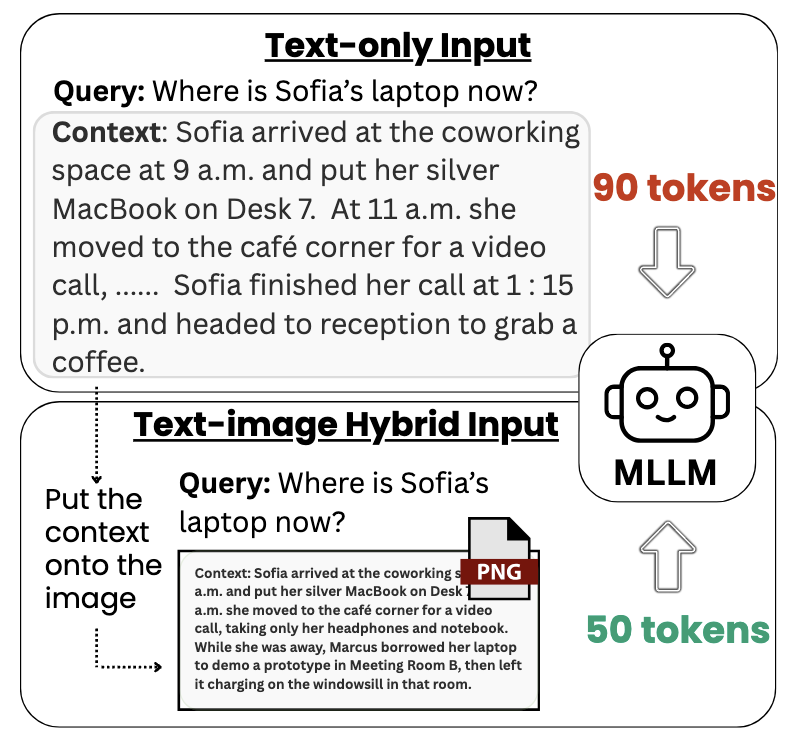
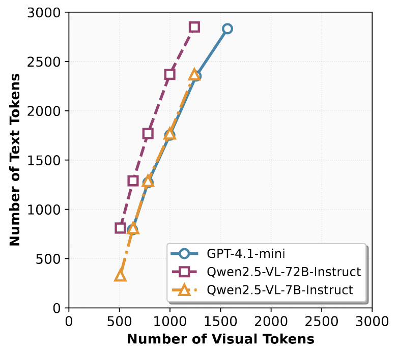

# Text or Pixels? It Takes Half: On the Token Efficiency of Visual Text Inputs in Multimodal LLMs【EMNLP 2025 (Findings) 🔥】
[](https://github.com/yanhong-lbh/text_or_pixels)
<a href="https://arxiv.org/abs/2510.18279" target="_blank">
    </a>
[](LICENSE)

*Yanhong Li\*, Zixuan Lan\*, Jiawei Zhou*  
(\*Equal contribution)

> **A picture is worth a thousand words**


## Overview

We demonstrate **off-the-shelf** vision language models (VLMs) have innate capabilities of compressing text with vision tokens to process information more efficiently. We explore a simple yet effective approach to represent textual inputs with rendered images for large language model (LLM) decoders, where we consistently observe around 1/2 compression ratio, i.e. half of the decoder input tokens are naturally reduced without loss of task accuracy. _Note that no specific OCR or text-as-image task fine-tuning is applied._


<p align="center">
    
<p>


By feeding context as a single image instead of raw text tokens, we find:

- **~50% token reduction** without performance loss
- **Up to 45% latency improvement** on larger models
- **Competitive performance** on long-context information retrieval and long-document summarization tasks

<!-- 
*Figure 2: Text token tolerance analysis. The maximum text tokens that can be preserved without accuracy loss, plotted against the visual tokens generated from the image. Results show a consistent reduction of roughly 1/2 in decoder tokens.* -->


## Installation

### Prerequisites

This project requires system-level dependencies that **cannot be installed via pip alone**:
- **poppler-utils**: Required by `pdf2image` for PDF processing
- **Tectonic**: LaTeX engine for document rendering

### System Dependencies (Required)

#### For Ubuntu/Debian:

```bash
# Update package list
apt-get update -qq

# Install poppler-utils (required for pdf2image)
apt-get install -y poppler-utils

# Install Tectonic (LaTeX engine)
wget https://github.com/tectonic-typesetting/tectonic/releases/download/tectonic%400.15.0/tectonic-0.15.0-x86_64-unknown-linux-musl.tar.gz
tar -xzf tectonic-0.15.0-x86_64-unknown-linux-musl.tar.gz
mv tectonic /usr/local/bin/
chmod +x /usr/local/bin/tectonic
```

#### For macOS:

```bash
brew install poppler tectonic
```

#### For other Linux distributions:

Use your package manager to install `poppler-utils` and follow the [Tectonic installation instructions](https://tectonic-typesetting.github.io/en-US/install.html) for your platform.

### Python Dependencies

After installing system dependencies, clone the repository and install Python packages:

```bash
git clone https://github.com/yanhong-lbh/text_or_pixels.git
cd text_or_pixels

pip install -r requirements.txt
```

### LM Evaluation Harness (Required for data generation)

The project uses the LM Evaluation Harness for generating long-context evaluation data. Install it separately:

```bash
git clone --depth 1 https://github.com/EleutherAI/lm-evaluation-harness
cd lm-evaluation-harness
pip install -e .
cd ..
```
---

## Quick Start

### 1. Generate Long-Context Data

Use the LM Evaluation Harness to generate RULER NIAH (Needle-in-a-Haystack) tasks:

```bash
pip install lm_eval

lm_eval --model hf \
    --model_args pretrained=Qwen/Qwen2.5-0.5B-Instruct \
    --tasks niah_single_1 \
    --device cuda:0 \
    --batch_size 32 \
    --log_samples \
    --output_path data/ruler_niah_single_1_len500 \
    --metadata='{"max_seq_lengths":[500]}'
```

### 2. Convert Text to Images

Transform long text contexts into images with specified dimensions:

```bash
python text_to_image.py \
    --input data/ruler_niah_single_1_len500/samples_niah_single_1_2025-06-27T15-36-26.531929.jsonl \
    --data_dir images/ruler_niah_single_1/600_1000_500 \
    --width 600 \
    --height 1000
```

### 3. Run Evaluations

#### GPT-4o-mini

```bash
export OPENAI_API_KEY='your-api-key-here'

python run_gpt.py \
    --model gpt-4o-mini \
    --image_dir images/ruler_niah_single_1/600_1000_500 \
    --file_path data/ruler_niah_single_1_len500/samples_niah_single_1_2025-06-27T15-36-26.531929.jsonl \
    --num_samples 100 \
    --output gpt4o_mini_results.json
```

#### Qwen2.5-VL

```bash
python run_qwen.py \
    --model Qwen/Qwen2.5-VL-72B-Instruct \
    --image_dir images/ruler_niah_single_1/600_1000_500 \
    --file_path data/ruler_niah_single_1_len500/samples_niah_single_1_2025-06-27T15-36-26.531929.jsonl \
    --num_samples 100 \
    --output qwen_results.json
```
<!-- 
---

## Key Results

### RULER S-NIAH (Long-Context Retrieval)

| Model | Text Tokens | Visual Tokens | Compression | Accuracy |
|-------|-------------|---------------|-------------|----------|
| GPT-4.1-mini | 1,000 | 442 | 56% | 99% |
| Qwen2.5-VL-72B | 1,000 | 418 | 58% | 97% |

### CNN/DailyMail (Document Summarization)

| Model | Method | Tokens | ROUGE-1 | ROUGE-2 | ROUGE-L |
|-------|--------|--------|---------|---------|---------|
| GPT-4.1-mini | Text-only | 693 | 23.78 | 8.60 | 16.26 |
| GPT-4.1-mini | Text-as-image | 225 (-67%) | 21.98 | 7.40 | 15.31 |
| Qwen2.5-VL-72B | Text-only | 726 | 25.18 | 9.47 | 17.70 |
| Qwen2.5-VL-72B | Text-as-image | 279 (-62%) | 23.28 | 7.54 | 15.53 |


--- -->

## Contact

- Yanhong Li - [yanhongl@allenai.org](mailto:yanhongl@allenai.org)
- Zixuan Lan - [zixuanlan@uchicago.edu](mailto:zixuanlan@uchicago.edu)
- Jiawei Zhou - [jiawei.zhou.1@stonybrook.edu](mailto:jiawei.zhou.1@stonybrook.edu)
